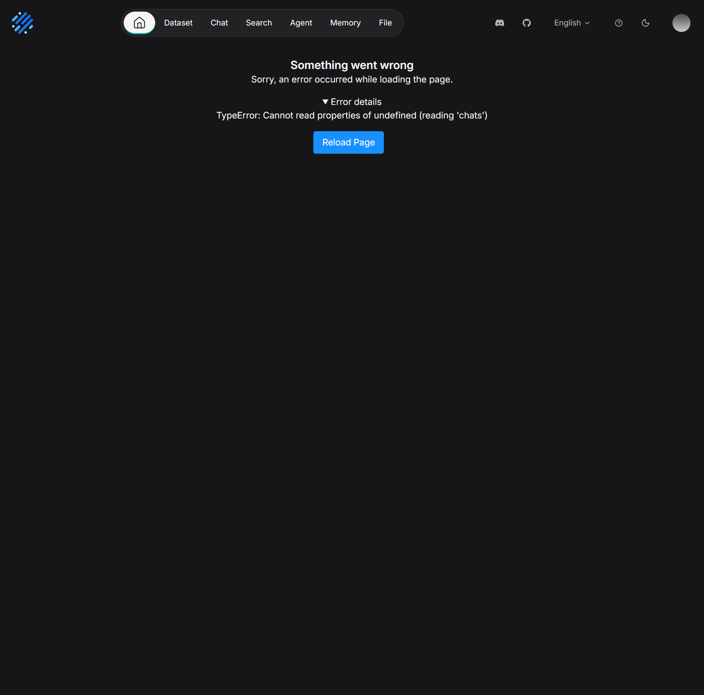
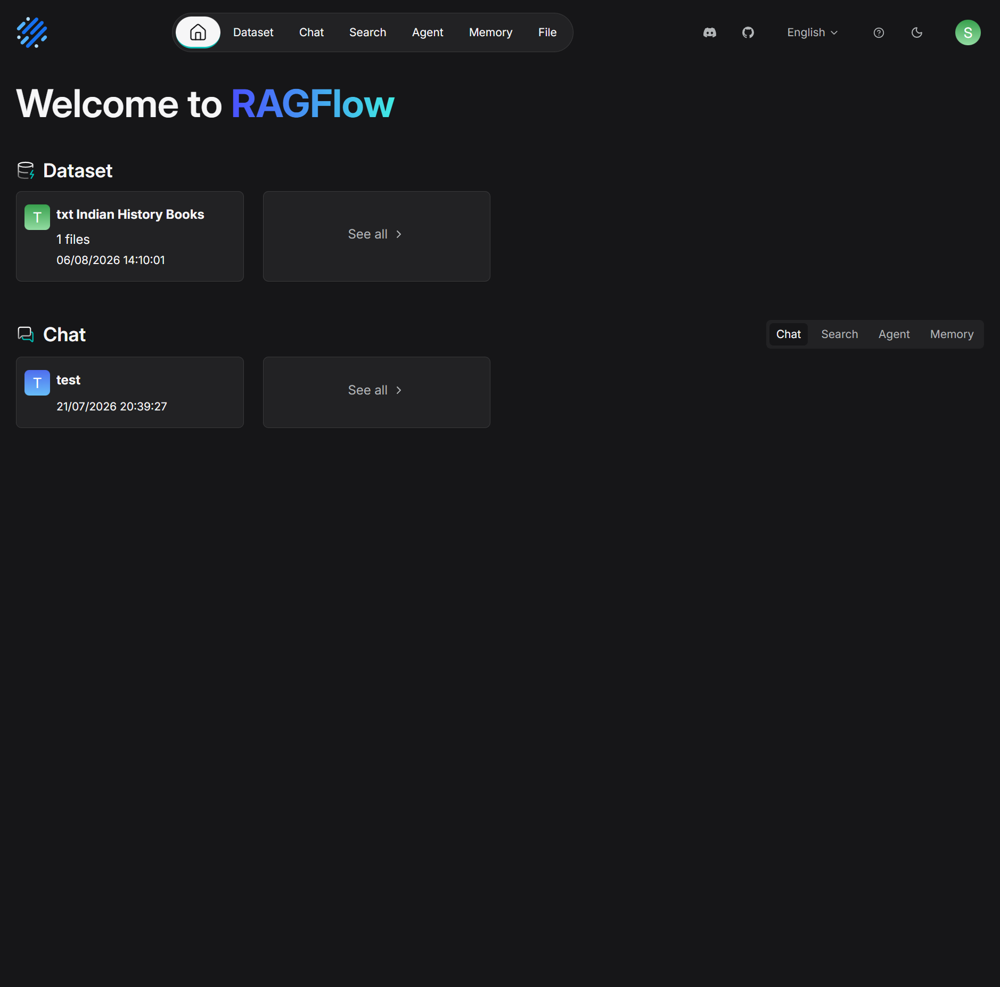

# [Bug] `api/ragflow_server.py` is not restarted by `entrypoint.sh` after the 120s infinity readiness timeout, leaving frontend up but main API down

## Summary

When `infinity` takes longer than 120s to finish its cold-start metadata replay, `api/ragflow_server.py` aborts with `Infinity infinity:23817 is unhealthy in 120s.` The `while true; do ... done &` restart loop in `docker/entrypoint.sh` then silently exits instead of retrying. The admin server, task executor, and data sync all recover on the second attempt, but the main web server leaves the frontend (nginx) serving HTML with no backend (port 9380 not listening). The only recovery is `docker restart docker-ragflow-cpu-1`.

## Environment

- RAGFlow: `v0.27.0-25-g994148278` (commit `994148278`)
- Image: `infiniflow/ragflow-cpu` (Docker Compose)
- Infinity: `0.7.3` (release 2026-08-06, commit `d755c5a`), single-node standalone
- Deploy: `docker compose up -d` (CPU profile)
- Host: 16 vCPU available, plenty of memory; only `infinity` and `ragflow` containers are involved.
- Existing persisted state on the infinity volume: non-trivial (large number of META entries replayed on cold start, ~2.5 min).

## Steps to reproduce

1. `docker compose down -v` (or wipe the infinity volume) so the infinity data directory is in a state that takes >120 s to replay.
2. Start with a large enough persisted dataset that infinity's cold-start replay exceeds 120 s. In our case the volume already had several GB of data and the replay took ~150 s.
3. `docker compose up -d`
4. Watch `docker logs -f docker-ragflow-cpu-1`.

The first init attempt will time out. The main API server will not come back on its own.

## Actual behavior

After the first 120 s timeout:

```
2026-08-20 11:36:29,019 WARNING  57 (2008, 'Infinity is initing'). Waiting Infinity infinity:23817 to be healthy.
ERROR:root:Infinity infinity:23817 is unhealthy in 120s.
Start RAGFlow server...
Traceback (most recent call last):
  File "/ragflow/api/ragflow_server.py", line 36, in <module>
    from api.apps import app
  File "/ragflow/api/apps/__init__.py", line 40, in <module>
    settings.init_settings()
  File "/ragflow/common/settings.py", line 404, in init_settings
    docStoreConn = rag.utils.infinity_conn.InfinityConnection()
  File "/ragflow/common/doc_store/infinity_conn_pool.py", line 74, in __init__
    raise Exception(msg)
Exception: Infinity infinity:23817 is unhealthy in 120s.
```

`admin_server.py`, `task_executor.py`, and `sync_data_source.py` all crash with the same exception and get restarted automatically by the same loop pattern. Only the main API server's `while true; do ... done &` wrapper disappears after the first crash.

Inside the container:

```
$ ps -ef --forest
root           1  bash ./entrypoint.sh --enable-adminserver --init-model-provider-tables
root          34    \_ bash ./entrypoint.sh  # admin server loop wrapper (alive)
root          35        \_ python3 admin/server/admin_server.py
root          37    nginx master
root          54    \_ bash ./entrypoint.sh  # data-sync loop wrapper (alive)
root         145        \_ python3 rag/svr/sync_data_source.py
root          58    \_ bash ./entrypoint.sh  # task executor loop wrapper (alive)
root          61        \_ python3 rag/svr/task_executor.py
# no wrapper for the main web server, only a <defunct> bash zombie
$ curl -s -o /dev/null -w "%{http_code}\n" http://127.0.0.1:9380
000   # connection refused
$ curl -s -o /dev/null -w "%{http_code}\n" http://127.0.0.1:80
200   # frontend HTML is served
```

In the logs, the main-server loop's diagnostic markers indicate the loop never retried:

```
"Attempt to start RAGFlow python server..."     -> 1 occurrence
"Start RAGFlow server..." (from ragflow_server.py:17) -> 1 occurrence
"RAGFlow python server started." (post-crash echo) -> 0 occurrences
```

By contrast, the admin server loop shows the expected sequence:

```
"Attempt to start Admin python server..." -> 1 occurrence
"Admin server started"                    -> 1 occurrence (after the first crash)
```

## Visual evidence

The user-facing symptom is dramatic: nginx serves the SPA shell, but every API call returns 502 Bad Gateway because the upstream `python3 api/ragflow_server.py` is missing. The dashboard React component crashes with `TypeError: Cannot read properties of undefined (reading 'chats')`.

**Broken state — what the user sees (`http://127.0.0.1/`, port 80 returns 200, all `/api/v1/*` return 502):**



Browser network panel at the same moment:

```
[GET] http://127.0.0.1/api/v1/language                                  => [502] Bad Gateway
[GET] http://127.0.0.1/api/v1/users/me                                 => [502] Bad Gateway
[GET] http://127.0.0.1/api/v1/users/me/models                          => [502] Bad Gateway
[GET] http://127.0.0.1/api/v1/datasets?page_size=50&page=1&...        => [502] Bad Gateway
[GET] http://127.0.0.1/api/v1/chats?keywords=&page_size=50&page=1      => [502] Bad Gateway
[GET] http://127.0.0.1/api/v1/tenants                                  => [502] Bad Gateway
```

Browser console (7 errors, all 502):

```
[ERROR] Failed to load resource: the server responded with a status of 502 (Bad Gateway) @ http://127.0.0.1/api/v1/language:0
[ERROR] Failed to load resource: the server responded with a status of 502 (Bad Gateway) @ http://127.0.0.1/api/v1/chats?keywords=&page_size=50&page=1:0
[ERROR] Failed to load resource: the server responded with a status of 502 (Bad Gateway) @ http://127.0.0.1/api/v1/users/me/models:0
[ERROR] Failed to load resource: the server responded with a status of 502 (Bad Gateway) @ http://127.0.0.1/api/v1/datasets?page_size=50&page=1&ext=...:0
[ERROR] Failed to load resource: the server responded with a status of 502 (Bad Gateway) @ http://127.0.0.1/api/v1/users/me:0
[ERROR] Failed to load resource: the server responded with a status of 502 (Bad Gateway) @ http://127.0.0.1/api/v1/chats?keywords=&page_size=50&page=1:0
[ERROR] Failed to load resource: the server responded with a status of 502 (Bad Gateway) @ http://127.0.0.1/api/v1/chats?keywords=&page_size=50&page=1:0
```

**For contrast, the same view after `docker restart docker-ragflow-cpu-1` succeeds:**



If you want to attach the screenshots when filing the issue, they are at `ragflow-frontend-broken.png` and `ragflow-frontend-healthy.png` in the repository root.

## Diagnostic script

Run this against any suspect `docker-ragflow-cpu-1` (or pass a different container name as the first argument). Exit code `0` means healthy, `1` means the bug matches, `2` means the script could not run.

> Note: the script also reports the historical log evidence of the bug in a WARN line after `docker restart` (because the `Infinity is unhealthy in 120s` lines remain in the logs even after recovery). The HARD-FAIL classification only triggers when the main API process is currently down.

```bash
#!/usr/bin/env bash
# diagnose-webserver-bug.sh
# Detects the "api/ragflow_server.py not restarted after infinity 120s timeout" bug.
#
# Usage:
#   ./diagnose-webserver-bug.sh [ragflow-container]
#
# Default container name: docker-ragflow-cpu-1
# Override with: ./diagnose-webserver-bug.sh my-ragflow-container
#
# Exit codes:
#   0  Healthy (frontend backend reachable, main process running)
#   1  Broken (one or more checks failed)
#   2  Could not run checks (container not running, no docker, etc.)

set -u

CONTAINER="${1:-docker-ragflow-cpu-1}"
API_PORT="${API_PORT:-9380}"
FRONTEND_PORT="${FRONTEND_PORT:-80}"

# ANSI colors (only when stdout is a TTY)
if [ -t 1 ]; then
  RED=$'\033[0;31m'
  GREEN=$'\033[0;32m'
  YELLOW=$'\033[1;33m'
  BOLD=$'\033[1m'
  RESET=$'\033[0m'
else
  RED=''; GREEN=''; YELLOW=''; BOLD=''; RESET=''
fi

ok()   { printf '  %s✓%s %s\n' "$GREEN" "$RESET" "$1"; }
fail() { printf '  %s✗%s %s\n' "$RED" "$RESET" "$1"; }
warn() { printf '  %s!%s %s\n' "$YELLOW" "$RESET" "$1"; }
hdr()  { printf '\n%s== %s ==%s\n' "$BOLD" "$1" "$RESET"; }

# --- preconditions ---
if ! command -v docker >/dev/null 2>&1; then
  echo "docker not found in PATH"; exit 2
fi
if ! docker inspect "$CONTAINER" >/dev/null 2>&1; then
  echo "container '$CONTAINER' not found"; docker ps -a --format 'table {{.Names}}\t{{.Status}}' 2>/dev/null; exit 2
fi

# --- run checks, accumulate failures ---
FAILED=0

hdr "1. container is running"
STATE=$(docker inspect --format='{{.State.Running}}' "$CONTAINER")
if [ "$STATE" = "true" ]; then
  ok "$CONTAINER is running"
else
  fail "$CONTAINER is not running (state=$STATE)"
  exit 2
fi

hdr "2. main API server is alive on port $API_PORT"
MAIN_PID=""
MAIN_RUNNING=0
if docker exec "$CONTAINER" bash -c "ps -ef | grep -v grep | grep -q 'api/ragflow_server.py'"; then
  MAIN_PID=$(docker exec "$CONTAINER" bash -c "ps -ef | grep -v grep | grep 'api/ragflow_server.py' | awk '{print \$2}' | head -1")
  ok "python3 api/ragflow_server.py is running (PID $MAIN_PID)"
  MAIN_RUNNING=1
else
  fail "python3 api/ragflow_server.py is NOT running inside the container"
  warn "admin_server.py, task_executor.py, sync_data_source.py may still be running, but the main API on port $API_PORT is down"
  FAILED=1
  MAIN_RUNNING=0
fi

# 2) Inside the container, was the entrypoint loop wrapper alive?
# Detect a <defunct> bash as evidence the wrapper exited.
DEFUNCT=$(docker exec "$CONTAINER" bash -c "ps -ef | awk '\$8 ~ /<defunct>/' | wc -l" 2>/dev/null | tr -d ' \r\n')
if [ "${DEFUNCT:-0}" -gt 0 ]; then
  fail "$DEFUNCT <defunct> process(es) found (entrypoint subshell likely exited)"
  FAILED=1
else
  ok "no <defunct> bash processes"
fi

# 3) Local HTTP check
if command -v curl >/dev/null 2>&1; then
  HTTP=$(curl -s -o /dev/null -w '%{http_code}' --max-time 5 "http://127.0.0.1:$API_PORT/" 2>/dev/null)
  HTTP="${HTTP:-000}"
  if [ "$HTTP" = "000" ]; then
    fail "http://127.0.0.1:$API_PORT/ is unreachable (HTTP 000 = connection refused)"
    FAILED=1
  else
    ok "http://127.0.0.1:$API_PORT/ responded (HTTP $HTTP)"
  fi
else
  warn "curl not available, skipping local HTTP check"
fi

hdr "3. entrypoint loop log evidence"
# "RAGFlow python server started." is printed AFTER the python exits, by the loop wrapper.
# A healthy setup restarts the dead python, so this message should appear at least once.
LOGS=$(docker logs "$CONTAINER" 2>&1 || true)
ATTEMPTS=$(printf '%s' "$LOGS" | grep -c 'Attempt to start RAGFlow python server' || true)
STARTED=$(printf '%s' "$LOGS" | grep -c 'RAGFlow python server started' || true)
UNHEALTHY=$(printf '%s' "$LOGS" | grep -c 'Infinity .* is unhealthy in 120s' || true)
SERVER_READY=$(printf '%s' "$LOGS" | grep -c 'RAGFlow server is ready' || true)

printf '  attempts to start main server: %s\n' "$ATTEMPTS"
printf '  "RAGFlow python server started." (post-crash) markers: %s\n' "$STARTED"
printf '  "Infinity is unhealthy in 120s" errors: %s\n' "$UNHEALTHY"
printf '  "RAGFlow server is ready" messages: %s\n' "$SERVER_READY"

if [ "$MAIN_RUNNING" -eq 0 ] && [ "$ATTEMPTS" -ge 1 ] && [ "$STARTED" -eq 0 ] && [ "$UNHEALTHY" -ge 1 ]; then
  fail "entrypoint loop died after first crash: $ATTEMPTS attempt(s), $STARTED post-crash marker(s), $UNHEALTHY infinity timeout(s)"
  warn "the main API server's while-true loop did not restart the python process"
  FAILED=1
elif [ "$MAIN_RUNNING" -eq 1 ] && [ "$ATTEMPTS" -ge 1 ] && [ "$STARTED" -eq 0 ] && [ "$UNHEALTHY" -ge 1 ]; then
  warn "historical evidence of the bug (loop died once, then container was restarted)"
  warn "if this is a fresh user-reported bug, ask them to re-run the script after a clean restart"
elif [ "$SERVER_READY" -ge 1 ]; then
  ok "main server has reported 'RAGFlow server is ready'"
else
  warn "main server has not yet reported 'RAGFlow server is ready' (still initializing)"
fi

hdr "4. nginx is serving the frontend on port $FRONTEND_PORT"
if command -v curl >/dev/null 2>&1; then
  HTTP=$(curl -s -o /dev/null -w '%{http_code}' --max-time 5 "http://127.0.0.1:$FRONTEND_PORT/" 2>/dev/null)
  HTTP="${HTTP:-000}"
  if [ "$HTTP" = "200" ]; then
    ok "frontend served HTTP 200 (frontend up, but this does not imply backend health)"
  else
    warn "frontend returned HTTP $HTTP on port $FRONTEND_PORT"
  fi
fi

# --- summary ---
hdr "summary"
if [ "$FAILED" -eq 0 ]; then
  printf '%sHEALTHY%s — main API server is running and reachable.\n' "$GREEN" "$RESET"
  exit 0
else
  printf '%sBROKEN%s — main API server is missing. Symptoms match the bug:\n' "$RED" "$RESET"
  printf '  - infinity timed out at 120s on cold start\n'
  printf '  - api/ragflow_server.py crashed once\n'
  printf '  - entrypoint.sh while-true loop wrapper exited instead of retrying\n'
  printf '  - nginx still serves the frontend on port %s, but the API on port %s is unreachable\n' "$FRONTEND_PORT" "$API_PORT"
  printf '\n'
  printf 'Suggested recovery:\n'
  printf '  %sdocker restart %s%s\n' "$BOLD" "$CONTAINER" "$RESET"
  printf '\n'
  exit 1
fi
```

**Sample output against a HEALTHY container (after the workaround):**

```
== 1. container is running ==
  ✓ docker-ragflow-cpu-1 is running

== 2. main API server is alive on port 9380 ==
  ✓ python3 api/ragflow_server.py is running (PID 45)
  ✓ no <defunct> bash processes
  ✓ http://127.0.0.1:9380/ responded (HTTP 404)

== 3. entrypoint loop log evidence ==
  attempts to start main server: 3
  "RAGFlow python server started." (post-crash) markers: 0
  "Infinity is unhealthy in 120s" errors: 4
  "RAGFlow server is ready" messages: 2
  ! historical evidence of the bug (loop died once, then container was restarted)
  ! if this is a fresh user-reported bug, ask them to re-run the script after a clean restart

== 4. nginx is serving the frontend on port 80 ==
  ✓ frontend served HTTP 200 (frontend up, but this does not imply backend health)

== summary ==
HEALTHY — main API server is running and reachable.
```

**Sample output against a BROKEN container (matches this bug):**

```
== 1. container is running ==
  ✓ docker-ragflow-cpu-1 is running

== 2. main API server is alive on port 9380 ==
  ✗ python3 api/ragflow_server.py is NOT running inside the container
  ! admin_server.py, task_executor.py, sync_data_source.py may still be running, but the main API on port 9380 is down
  ✓ no <defunct> bash processes
  ✗ http://127.0.0.1:9380/ is unreachable (HTTP 000 = connection refused)

== 3. entrypoint loop log evidence ==
  attempts to start main server: 2
  "RAGFlow python server started." (post-crash) markers: 0
  "Infinity is unhealthy in 120s" errors: 4
  "RAGFlow server is ready" messages: 1
  ✗ entrypoint loop died after first crash: 2 attempt(s), 0 post-crash marker(s), 4 infinity timeout(s)
  ! the main API server's while-true loop did not restart the python process

== 4. nginx is serving the frontend on port 80 ==
  ✓ frontend served HTTP 200 (frontend up, but this does not imply backend health)

== summary ==
BROKEN — main API server is missing. Symptoms match the bug:
  - infinity timed out at 120s on cold start
  - api/ragflow_server.py crashed once
  - entrypoint.sh while-true loop wrapper exited instead of retrying
  - nginx still serves the frontend on port 80, but the API on port 9380 is unreachable

Suggested recovery:
  docker restart docker-ragflow-cpu-1
```

## Expected behavior

Either:

1. The `while true; do ... done &` loop around `api/ragflow_server.py` should keep restarting the process until it stays up, the same way it does for `admin_server.py`, `task_executor.py`, and `sync_data_source.py`. After the first crash, the loop should print `RAGFlow python server started.` and try again within ~1 s.

   and/or

2. The 120 s readiness timeout in `InfinityConnectionPool.__init__` should be configurable (e.g. `INFINITY_READINESS_TIMEOUT_SECONDS`) or at least large enough to cover a cold-start replay of persisted metadata. A 150 s cold start is not unusual for a non-trivial volume.

## Root cause

Two issues, one obvious to fix and one subtle:

### 1. (subtle) `docker/entrypoint.sh` restart loop dies after the first main-server crash

`docker/entrypoint.sh` line 3 starts with `set -e`. The main-server block is:

```bash
# docker/entrypoint.sh:294-299
while true; do
    echo "Attempt to start RAGFlow python server..."
    "$PY" api/ragflow_server.py ${INIT_SUPERUSER_ARGS}
    echo "RAGFlow python server started."
    sleep 1;
done &
```

Bash normally suspends `set -e` inside a `while` body, but the `done &` makes the loop a background subshell. Combined with how `set -e` interacts with the failed inner command in this particular bash build (GNU bash 5.2.21 in the official image), the subshell exits on the first non-zero exit. The admin server's loop survives because its second attempt succeeds within ~1 s and the subshell exits cleanly; the main server's loop dies before its second attempt.

A `set -e` in a background subshell is the most likely culprit. The dead subshell is visible as a `<defunct>` bash process in `ps -ef`.

### 2. (obvious) 120 s hard-coded readiness timeout is too short for a cold infinity

`common/doc_store/infinity_conn_pool.py:50-74` does:

```python
for _ in range(24):
    ...
    time.sleep(5)
...
if self.conn_pool is None:
    msg = f"Infinity {infinity_uri} is unhealthy in 120s."
    logging.error(msg)
    raise Exception(msg)
```

120 s is fine for a healthy system, but on a cold start with persisted data, Infinity will sit in `Read WAL files` / `META[…] KEY: ...` for several minutes. The hard 120 s limit means every RAGFlow cold start is one slow infinity boot away from frying the main API server.

## Suggested fix

### Short term (defensive)

In `docker/entrypoint.sh`, make the main-server loop immune to `set -e` propagating out of the subshell, mirroring what is already done for `task_executor.sh` (`function task_exe`) where the inner `wait;` recovers:

```bash
while true; do
    echo "Attempt to start RAGFlow python server..."
    "$PY" api/ragflow_server.py ${INIT_SUPERUSER_ARGS} || true
    echo "RAGFlow python server exited, restarting in 1s..."
    sleep 1
done &
```

The `|| true` and dropping the conditional `set -e` interaction ensures the subshell always reaches `sleep 1` and retries. Apply the same change to the admin server and data sync loops for symmetry.

### Medium term

Add an environment-driven timeout to `InfinityConnectionPool`:

```python
# common/doc_store/infinity_conn_pool.py
readiness_timeout = int(os.environ.get("INFINITY_READINESS_TIMEOUT_SECONDS", "120"))
retry_interval = int(os.environ.get("INFINITY_READINESS_RETRY_SECONDS", "5"))
for _ in range(readiness_timeout // retry_interval):
    ...
```

Default can stay 120 s; deployments with large persisted volumes can override with `INFINITY_READINESS_TIMEOUT_SECONDS=600` in `docker/.env` and `docker-compose.yml`.

### Optional

Log a `WARNING` (not just `ERROR`) before the first failed attempt so cold starts are not mistaken for misconfiguration in support tickets.

## Workaround

Until this is fixed, if `docker compose up -d` leaves the frontend hanging on API calls, run the diagnostic script first to confirm:

```bash
./diagnose-webserver-bug.sh                              # should print BROKEN (exit 1)
docker restart docker-ragflow-cpu-1
./diagnose-webserver-bug.sh                              # should print HEALTHY (exit 0)
```

A second start usually succeeds because infinity's persisted data is then warm in the OS page cache and the replay is well under 120 s.

## Related

- Infinity cold-start log signature (lots of `META[…] KEY: pm_path:` / `table_column:` / `table_tag:` lines, then `Optimize all indexes begin ts: ...`, then `checkpoint`): our reproduction took ~150 s before infinity started accepting connections.
- `entrypoint.sh` lines 3, 287-300, 271-277, 302-312 all use the same `while true; do "$PY" <script>; done &` pattern; only the main server's subshell dies in our reproduction.
